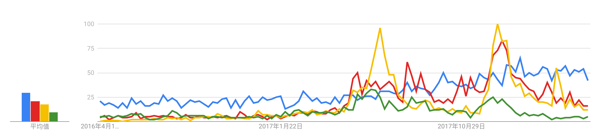
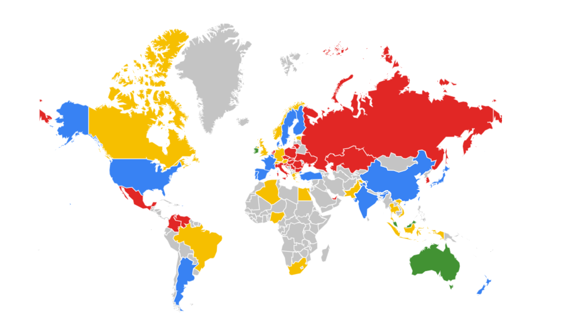
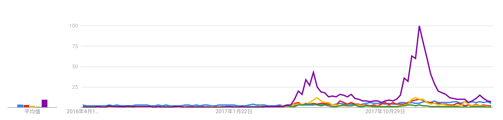
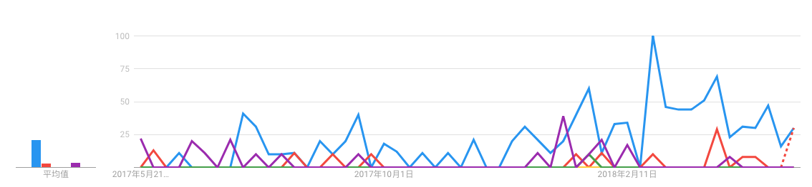

[TOC]

## 基本信息


|     项目      |             国家             |           主网站           | 发行总量 | 启动时间 |                          白皮书地址                          |                         git仓库地址                          |   开源协议   |     ICO      |
| :-----------: | :--------------------------: | :------------------------: | :------: | :------: | :----------------------------------------------------------: | :----------------------------------------------------------: | :----------: | :----------: |
|   holochain   |           直布罗陀           | [holochain](holochain.org) |  156亿   | 2017.01  | [白皮书地址](https://github.com/holochain/holochain-proto/blob/whitepaper/holochain.pdf) |   [仓库地址](https://github.com/holochain/holochain-proto)   |   LGPL-3.0   |     HOT      |
| ipfs/filecoin |             美国             |      [IPFS](ipfs.io)       |   20亿   |   2015   | [白皮书地址](https://github.com/ipfs/papers/raw/master/ipfs-cap2pfs/ipfs-p2p-file-system.pdf) |         [仓库地址](https://github.com/ipfs/go-ipfs)          |     MIT      |     FIL      |
|     storj     |             美国             |     [storj](storj.io)      |  42.5亿  | 2016.03  |          [白皮书地址]( <https://storj.io/storj.pdf)          |     [仓库地址](https://github.com/storj/storjshare-gui)      | LGPL3.0/MIT  |    STORJ     |
|    Genaro     | 新加坡运营；注册中国软件版权 |  [Genaro](genaro.network)  |   7亿    | 2017.12  | [白皮书地址](https://genaro.network/en/documentation/whitepaper) | [仓库地址](https://github.com/GenaroNetwork/GenaroEden_Client) |   LPGL-2.1   |     GNX      |
|    siacoin    |             美国             |      [Sia](sia.tech)       | 445.5亿  |   2014   |            [白皮书地址](https://sia.tech/sia.pdf)            |       [仓库地址](https://github.com/NebulousLabs/Sia)        |     MIT      |      SC      |
|   MaidSafe    |            苏格兰            |  [MaidSafe](maidsafe.net)  |   43亿   | 2014.08  | [白皮书地址](https://github.com/maidsafe/Whitepapers/blob/master/Project-Safe.md) |   [仓库地址](https://github.com/maidsafe-archive/MaidSafe)   |      --      | MaidsafeCoin |
|   Burstcoin   |            美国？            |  [burst](burst-coin.org)   |  21.5亿  | 2014.12  | [白皮书地址](https://www.burst-coin.org/wp-content/uploads/2017/07/The-Burst-Dymaxion-1.00.pdf) |        [仓库地址](https://github.com/PoC-Consortium)         | MIT/LGPL-3.0 |    Burst     |


## 社区活跃度

|     项目      | twitter | github(stars) | facebook |    discord     | telegram | reddit |
| :-----------: | :-----: | :-----------: | :------: | :------------: | :------: | :----: |
|   holochain   |  2506   |     1379      |   2059   | unofficial 103 |   7695   |  1428  |
| ipfs/filecoin |  17.4K  |     5.5K      |    --    |       --       |    --    |  4038  |
|     storj     |   83K   |      461      |   8063   |       --       |   1760   |  7196  |
|    Genaro     |  11.4K  |      26       |  14800   |       --       |   4202   |  171   |
|    siacoin    |  104K   |     2.7K      |  18538   |     18774      |    --    | 31527  |
|   MaidSafe    |  57.4K  |      592      |   2583   |       --       |   1537   |  1677  |
|   Burstcoin   |  25.1K  |      181      |   156    |      5131      |   2545   |  6634  |

```
结论： IPFS社区运营最弱，通过数据看目前仅仅通过技术吸引世界目光；
	  Maidsafe是一家老牌的开源软件公司，06年成立，存储项目14年成立，是一个关注度极高的项目；
```


## 代码活跃度

|     项目      | issues | watch | star | fork | commits | branchs | release | contributor |
| :-----------: | :----: | :---: | :--: | :--: | :-----: | :-----: | :-----: | :---------: |
|   holochain   |  215   |  106  | 451  |  68  |  1379   |   27    |    2    |     23      |
| ipfs/filecoin |  817   |  427  | 5.5K | 965  |  8616   |   108   |   68    |     166     |
|     storj     |   51   |  99   | 461  | 114  |  1246   |    4    |   97    |     25      |
|    Genaro     |   0    |  18   |  26  |  6   |   276   |    2    |   16    |      5      |
|    siacoin    |  122   |  322  | 2.6K | 413  |  8912   |   32    |   42    |     47      |
|   MaidSafe    |   14   |  143  | 592  | 110  |  1791   |    2    |   13    |     20      |
|   Burstcoin   |   24   |  67   | 181  | 147  |  2125   |    2    |   11    |     30      |

```
结论：在技术社区，IPFS从各个维度都超过了同类竞品；
```


## 开发团队

|   项目    |                     主站总人数                     | developer | git contributor |
| :-------: | :------------------------------------------------: | :-------: | :-------------: |
| holochain |       [32](https://holochain.org/team.html)        |     5     |       23        |
|   ipfs    |          [15](https://protocol.ai/team/)           |    36     |       166       |
|   storj   |          [34](https://storj.io/team.html)          |     7     |       25        |
|  Genaro   |       [18](https://genaro.network/en/team/)        |     5     |        5        |
|  siacoin  |            [5](https://sia.tech/about)             |     3     |       47        |
| MaidSafe  | [23](https://maidsafe.net/company.html#who-we-are) |    12     |       20        |
| Burstcoin |   [14](https://www.burst-coin.org/contributors)    |     7     |       30        |


```
结论：IPFS的人员活跃度最可观；
```


## 技术栈

1. 语言

|   项目    |  language  |
| :-------: | :--------: |
| holochain |     Go     |
|   ipfs    |     Go     |
|   storj   | Javascript |
|  Genaro   | Javascript |
|  siacoin  |     Go     |
| MaidSafe  |  Rust/C++  |
| Burstcoin |    Java    |

```
结论：和本体技术栈最契合的是holochain，ipfs，siacoin；
     但是holochain偏向分布式架构，siacoin技术团队不稳定，故而ipfs更贴切本体的选择；
     maidsafe提出的自治理机制很有参考价值；
```

2. 理论基础

|   项目    |                  theories                   |
| :-------: | :-----------------------------------------: |
| holochain |                                             |
|   ipfs    | DHT(K桶算法)、Bittorrent(Bitswap)、Git、SFS |
|   storj   |                                             |
|  Genaro   |                                             |
|  siacoin  |                                             |
| MaidSafe  |                                             |
| Burstcoin |                                             |

```
结论：
```


## 社区技术生态

|   项目    | repos |
| :-------: | :---: |
| holochain |  30   |
|   ipfs    |  199  |
|   storj   |  63   |
|  Genaro   |  10   |
|  siacoin  |  29   |
| MaidSafe  |  38   |
| Burstcoin |  13   |


```
结论：IPFS最活跃
```


## 热度趋势分布(google trend)




【加入siacoin后的分布图】



> 注：就目前而言，holochain和burstcoin的google搜索流量极低，故没统计；

```
结论：在社区运营基本空白的情况下，IPFS稳步上升；
     maidsafe、siacoin、storj出现短暂的查询尖峰，随后仍被ipfs盖过；
```


## 品牌主打特性

|   项目    |                   Features                    |
| :-------: | :-------------------------------------------: |
| holochain |                分布式应用框架                 |
|   ipfs    | 内容可寻址、版本化、点对点超媒体的分布式协议  |
|   storj   | 去中心化、端到端加密、可持续的云存储，B端市场 |
|  Genaro   |        图灵计算完备的去中心化存储网络         |
|  siacoin  |               去中心化存储平台                |
| MaidSafe  |         自治理、去中心分布式存储网络          |
| Burstcoin |          基于容量证明的去中心化存储           |


```
结论： 在去中心化存储都具备的大前提下，maidsafe的自治理模式很新颖；
```


## 生态产品输出

|   项目    | 总数 |                     产品详情                     |                 已获投资产品                 |
| :-------: | :--: | :----------------------------------------------: | :------------------------------------------: |
| holochain |      |                                                  |                                              |
|   ipfs    |  47  | [官方产品列表](https://github.com/ipfs-shipyard) | [商品集市]( <https://github.com/OpenBazaar ) |
|   storj   |      |                                                  |                                              |
|  genaro   |      |                                                  |                                              |
|  siacoin  |      |                                                  |                                              |
| maidsafe  |      |                                                  |                                              |
| burstcoin |      |                                                  |                                              |

```
结论：
```


## 国内Blog聚集地

1. Holochain

   ```
   无
   ```

2. IPFS

   ```
   网站： ipfser.org； ipfs.fund；
   微信号：ipfs_guide，IPFS-Fund
   ```

3. storj

   ```
   微信号：storj社区
   ```

4. genaro

   ```
   无
   ```

5. siacoin

   ```
   无
   ```

6. maidsafe

   ```
   无
   ```

7. burstcoin

   ```
   无
   ```


【中国区热度趋势】




```
结论：国内对ipfs的关注远超过其他分布式存储系统；
```


## 调研细化

|   项目    | 人员 |
| :-------: | :--: |
| Holochain | 志杰 |
|  Siacoin  | 翔哥 |
| Burstcoin | 翔哥 |
|   Storj   | 笑杰 |
|  Genaro   | 笑杰 |
|   IPFS    | 一痕 |
| MaidSafe  | 一痕 |
|  白皮书   | 文彬 |