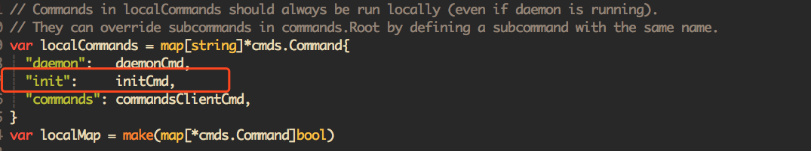
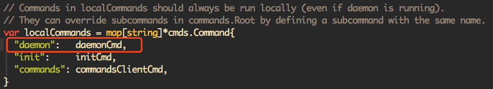
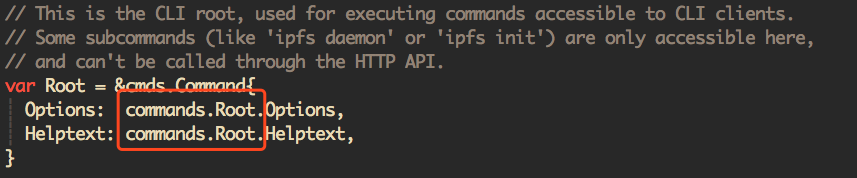
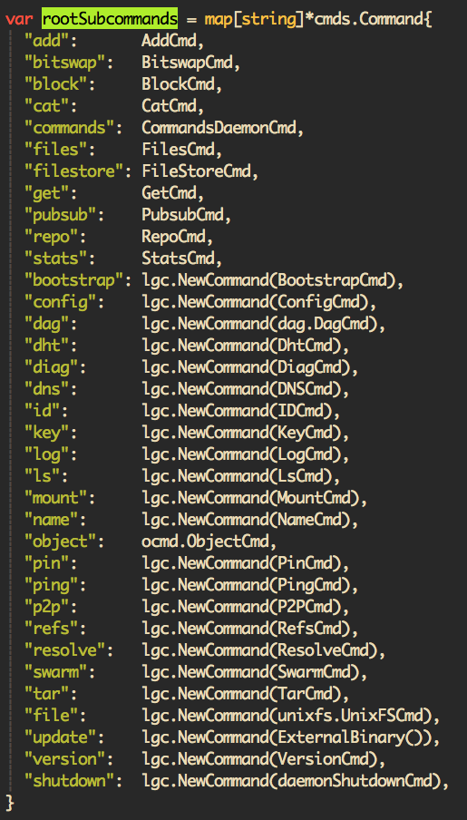

## 概述

从我个人理解，一次完整的ipfs节点使用周期，包含下面四个基本步骤：

1. 初始化IPFS节点

   ``` 
   初始化命令：./ipfs init
   命令对应的文件入口位置：$IPFS_PATH/cmd/ipfs/ipfs.go的26行
   ```

   

   > 通过该入口位置，可以跳转到initCmd的真正实现处，实现处位于同级目录下的init.go文件中，所有的初始化操作，最终会落到init.go文件中的doInit()流程里；

   [init详细流程分析请点击此处--不断完善中](../IPFS源码分析/ipfs init及配置文件说明.md)

   

2. 启动IPFS节点

   ```
   启动命令：./ipfs daemon
   命令对应的文件入口位置：$IPFS_PATH/cmd/ipfs/ipfs.go的25行
   ```

   

   >通过该入口位置，可以跳转到daemonCmd的真正实现处，实现处位于同级目录下的daemon.go文件中，所有的初始化操作，最终会落到daemon.go文件中的daemonFunc()流程里；

   [daemon详细流程分析请点击此处--不断完善中](../IPFS源码分析/ipfs daemon启动.md)

   

3. 上传数据至IPFS网络

   ```
   上传数据命令：./ipfs add ./file/name/to/ipfs
   命令对应的文件入口顺序：$IPFA_PATH/cmd/ipfs/ipfs.go的15行处有如下代码
   ```

   

   ```
   跳转至commands.Root的定义处(位于$IFPS_PATH/core/commands/root.go的第198行),可以看到Root的完整子命令定义；进入到rootSubcommands中，此处给出了ipfs所支持的所有命令，如下所示：
   ```

   

   ```
   进入AddCmd命令实现处，即可看到添加一个文件至IPFS网络的完整流程；
   ```

​	[AddCmd详细流程分析请点击此处--不断完善中](#../IPFS源码分析/ipfs ADD数据流程分析.md)


4. 从IPFS网络获取数据

   ```
   获取IPFS网络数据命令： ./ipfs get data-hash-value
   命令对应的文件入口顺序： 具体顺序和[3.上传数据至IPFS网络]类似，最终的实现步骤落到了子命令：GetCmd上；
   ```

   [GetCmd详细流程分析请点击此处--不断完善中](../IPFS源码分析/ipfs GET数据流程.md)


5. 退出IPFS节点

   ```
   命令：CTRL+C；收到SIGNAL后，ipfs会自动做资源回收处理，并优雅退出；
   ```

   