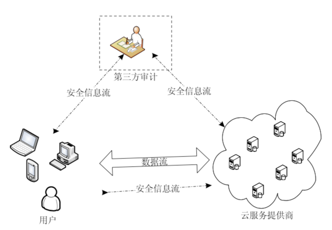
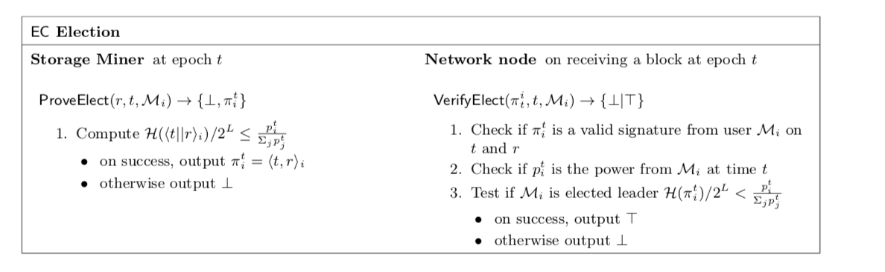

[TOC]

## 完整性证明考量的维度

1. 计算开销 **【重点】**

   ```
   包括拥有者对数据文件进行预处理所需的计算开销;
   服务端计算获得证据所需的计算开销;
   及客户端验证证据所需的计算开销;
   ```

2. 传输开销**【重点】**

   ```
   数据拥有者与服务器之间的数据 传输量;
   ```

3. 存储开销

   ```
   拥有者存储相关元数据 m 所需的存储开销;
   处理后所得持久数据与原始文件的比例;
   ```

4. 更新操作

   ```
   即是否支持数据所有者对数据进行更新，以及支持何种类型的更新操作，包括 Append、Modify、Delete 以及 Insert 等;
   ```

5. 挑战次数

   ```
   允许用户􏸮出挑战的次数;
   ```

6. 可恢复性

   ```
   部分数据出错时能否恢复原始数据的特性;
   ```


## 完整性证明中涉及的系统角色




## 完整性证明的基本步骤

数据完整性证明机制由Setup和Challenge两个阶段组成，通过采用抽样的策略对存储在DSN中的数据文件发起完整性验证

1. Setup阶段

   ```
   1.1 用户运行Key-Gen生成密钥对(pk,sk);
   1.2 用户对存储的数据进行分块F=(m1, m2, m3...);
   1.3 用户用本地生成的私钥对每个文件数据块，生成同态标签集合;
   1.4 用户将分块后的数据文件和签名集合，同时存入DSN；
   1.5 删除本地数据文件和签名结合；
   ```

2. Challenge阶段（验证者周期性的发起完整性验证）

   ```
   2.1 从文件分块索引集合[1, n]中随机跳去c个块索引，{s1, s2,..., sc}
   2.2 为每一个索引si选取一个随机数vi
   2.3 将上述两步组合起来生成一次挑战请求,发送给验证服务器；如下所示：
   ```

   

   ```
   2.4 服务器作为证明者，根据存储在服务器上的数据文件，调用GenProof,生成完整性证据P，返回给验证者；
   2.5 验证着接收证据后，执行CheckProof，验证证据是否正确；
   ```

   

## 完整性证明机制分类


## Filecoin中的数据完整性证明

```
Filecoin中的数据完整性证明是PoRep，整合了PDP、POR和安全处理机制(女巫攻击、外包攻击、代攻击)
1. 支持动态操作
2. 多副本
3. 可恢复
4. 安全攻击防范
```


## Filecoin内部交互流程


### Network

```
Network即区块链节点，需要处理的对象包括三种： 
1. 区块；
2. 新进订单；
3. 已有订单；
```


### Client

```
客户端即存取用户， 包含四个动作行为：
1. 提交存储请求订单；
2. 存储订单匹配成功后，发送数据；等待结账；
3. 提交检索请求订单；
4. 匹配成功后，接收数据，并结账；
```


### Storage Miner【存的时候，矿工主动发起deal订单】

```
1. 任意时刻都可以有的行为；
2. 每个处理周期可以有的行为；
3. 当收到用户存储数据的时候的行为；
```


### Retrieval Miner 【取的时候，client主动发起；没有交易订单的概念】

```
1. 等待client直接发起询价
2. 和client的支付通道
3. 将数据切割成N份
4. 按份交付，给一份钱，付一份数据
```


## Filecoin 共识流程(EC共识)



```
在每个共识周期内：
1. 各个存储节点参与共识出块；
2. 存储节点统计各自的有效存储占比；(基于时空证明)
3. 当满足公式的时候，节点提议出块；
4. 其他网络节点验证，当满足1/3容错的时候，落块；
```


